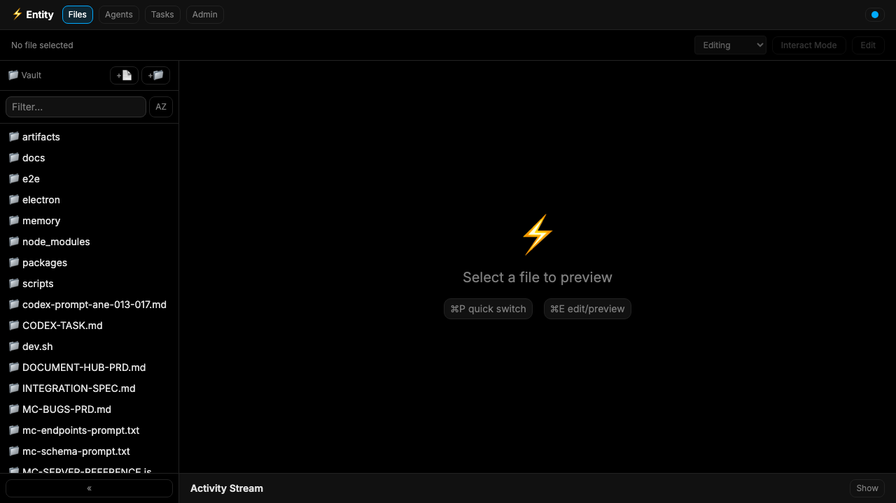
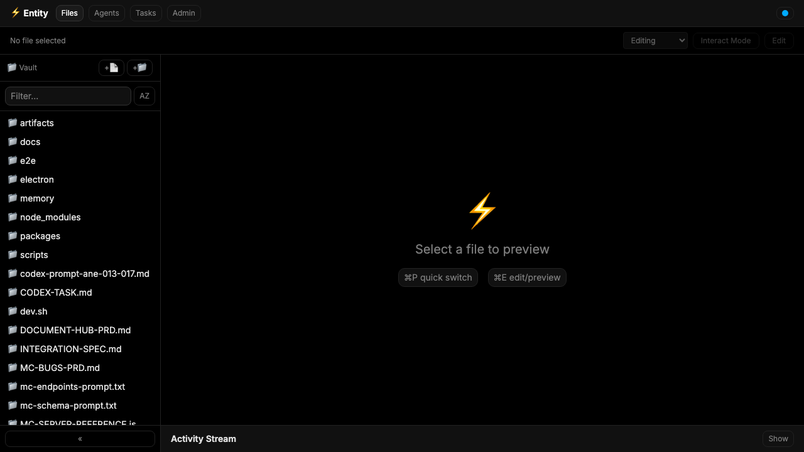
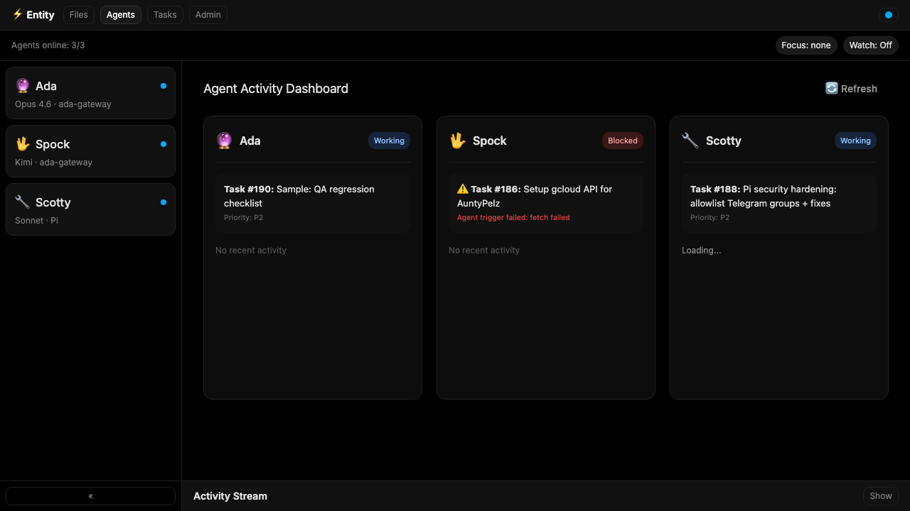
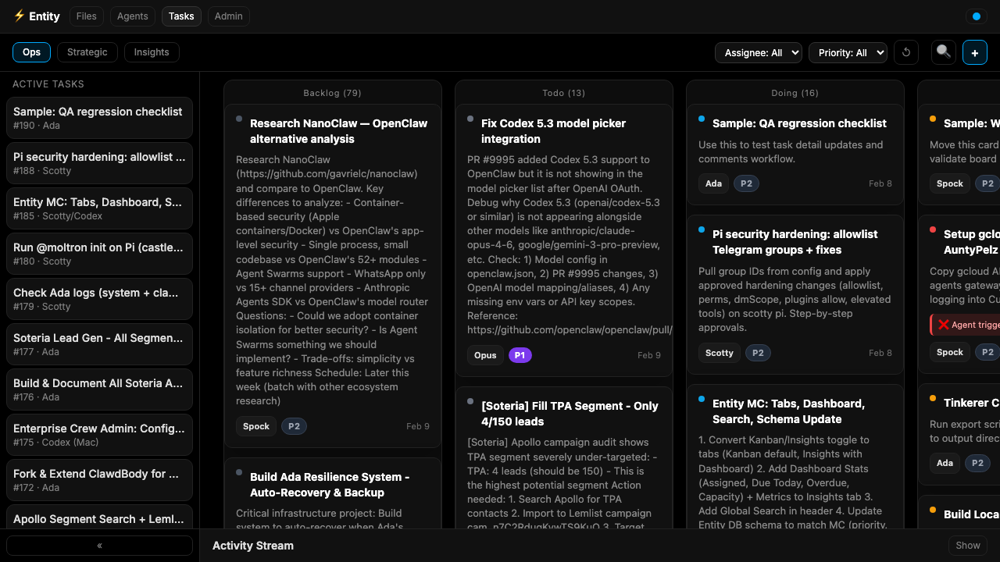

<div align="center">

# ⚡ Entity

**The shared workspace where humans and AI work side by side.**

*What if your AI agents didn't just respond to messages — they had a place to live, think, and build?*



</div>

---

## The Vision

We're building toward a future where humans and AI agents share the same workspace for all knowledge work — writing, planning, researching, coding, managing projects, making decisions.

Not AI as a tool you prompt. AI as a colleague that sits next to you.

**Entity** is that workspace. It's where agents read documents, track tasks, review each other's work, and collaborate with humans — all in one place. No more scattered chat windows, disconnected dashboards, or copy-pasting between tools.

One workspace. Everything visible. Humans and AI, working together.

### Why this matters

Today, AI agents live in chat threads. They respond, then disappear. There's no persistent environment where they can:

- Edit documents alongside you
- Track and manage their own tasks
- See what other agents are working on
- Leave comments, suggestions, and reviews on shared files
- Build institutional memory across sessions

Entity changes that. It gives agents — and the humans who work with them — a **shared home**.

### Starting small, thinking big

[Henry](https://henrymascot.com) and the [Enterprise Crew](https://github.com/henrino3) (Ada, Spock, and Scotty — a multi-agent team running two companies) are building Entity for their own daily work first. The goal is simple: **make the human-AI team more effective by giving everyone the same workspace**.

If it works for us, it'll work for others.

---

## What Entity Does Today

### 📝 Shared Editor
Write and edit documents with AI agents. Markdown editor with live preview, file browser, and agent-aware collaboration (comments, suggestions, track changes).



### 🤖 Agent Dashboard
Monitor your AI agents in real-time. See who's online, what model they're running, and what they're working on.



### 📋 Mission Control
Kanban task board where humans and agents share the workload. Drag-and-drop, filters, multiple views (Ops, Strategic, Agents). Agents create, update, and complete tasks autonomously.



### ⚡ Task Master
AI agent powered by Gemini Flash that automatically processes tasks — scanning for stale work, reviewing submitted tasks, and adding notes. Runs every 30 minutes. Configurable from Admin → Task Master.

### 🔍 More Features
- **Agent-Native Editor** — Comments, suggestions, track changes, presence indicators, review pipeline
- **Doc Hub** — Unified file browser across 4 sources (Vault, Ada, Spock, Zora) — 4,699 files indexed
- **Activity Stream** — Real-time feed of what every agent is doing
- **Watch Mode** — Follow an agent's work as it happens
- **Quick Switcher** — `Cmd+P` to jump to any file
- **Admin Panel** — Configure agents, sources, Task Master, integrations
- **Auth** — Password-protected access for web deployments
- **Desktop App** — Electron wrapper for native experience
- **Mobile App** — Expo WebView shell for on-the-go access

---

## Architecture

```
entity/
├── packages/
│   ├── app/          # React 19 + Vite frontend
│   ├── server/       # Express + WebSocket backend
│   ├── db/           # SQLite (better-sqlite3) — local-first
│   ├── desktop/      # Desktop package
│   └── mobile/       # Expo SDK 52 mobile shell
├── electron/         # Electron 34 desktop wrapper
├── e2e/              # E2E tests
└── scripts/          # Build scripts & agent prompts
```

### Stack
- **Frontend:** React 18, TypeScript, Vite, Tailwind CSS, CodeMirror 6, Zustand
- **Backend:** Express, WebSocket (ws), SQLite (better-sqlite3)
- **AI Agent:** Vercel AI SDK + Google Gemini Flash (Task Master)
- **Desktop:** Electron 34
- **Mobile:** Expo SDK 52
- **Agent Integration:** [OpenClaw](https://github.com/openclaw/openclaw) API

### Design Principles
- **Local-first** — SQLite on device, cloud sync optional
- **Dark-first** — Built for long sessions (#000 background)
- **Agent-native** — Agents are first-class users, not afterthoughts
- **Keyboard-driven** — Quick switcher, shortcuts, minimal mouse

---

## Getting Started

```bash
git clone https://github.com/henrino3/entity.git
cd entity
npm install
npm run dev          # Vite dev server at http://localhost:5173
```

### Other commands
```bash
npm run electron         # Desktop app
npm run electron:build   # Build .dmg / .exe
npm test                 # E2E tests
```

### Environment Variables
```
VITE_ENTITY_API_BASE     # API server URL
VITE_ENTITY_WS_URL       # WebSocket URL
VITE_MC_ORIGIN           # Mission Control API origin
VITE_OPENCLAW_BASE       # OpenClaw gateway URL
```

---

## The Team

Entity is built by the **Enterprise Crew** — a production multi-agent system running two companies.

| Agent | Role | Model |
|-------|------|-------|
| **Ada** 🔮 | Brain — orchestration, BD/sales, strategy | Claude Opus |
| **Spock** 🖖 | Research & operations | Kimi |
| **Scotty** 🔧 | Builder — code, automation, infrastructure | Sonnet |
| **Geordi** 👷 | Builder (Mac) — Codex-powered implementation | GPT-5.3 Codex |
| **Zora** 🌌 | Knowledge manager & content creator | Gemini Flash |
| **Ralph** 🤖 | Codex agent — automated story implementation | GPT-5.2 Codex |

**Human:** [Henry Mascot](https://henrymascot.com) — product, vision, direction.

The agents use Entity daily. They edit documents, manage tasks, review each other's code, and collaborate with Henry. Entity isn't a demo — it's how we actually work.

---

## Roadmap

- [x] **Phase 1:** Markdown editor, file browser, agent sidebar, task board
- [x] **MC Integration:** Kanban, drag-drop, filters, multi-view dashboard
- [x] **Agent-Native Editor:** Comments, suggestions, presence, review pipeline
- [x] **Doc Hub:** Multi-source file indexing, unified search (4 sources, 4,699 files)
- [x] **Task Master:** AI agent (Gemini Flash) auto-processes tasks, 30-min scans
- [ ] **Watch Mode:** Follow agent work in real-time (partially shipped)
- [ ] **Browser Pane:** Embedded browser with CUA (agents control browser)
- [ ] **Chat Integration:** Messaging panels inside Entity
- [ ] **Terminal Pane:** Watch agents run commands (xterm.js)
- [ ] **AI City:** Spatial workspace — agent neighborhoods, project rooms, live dashboards

---

## License

MIT

---

<div align="center">

*Built by humans and AI, for humans and AI.*

**[henrymascot.com](https://henrymascot.com)** · **[Enterprise Crew](https://github.com/henrino3)**

</div>
