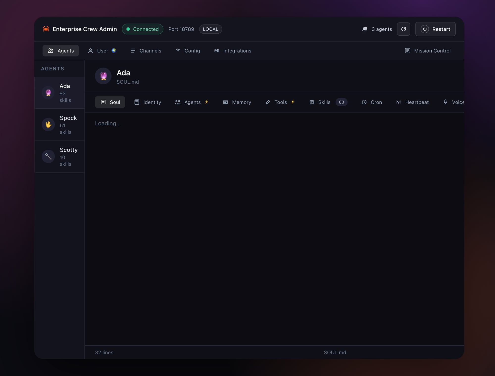

# Entity 🏗️

AI-native workspace. Where agents work and humans follow their journey.

## Features

- **Agent Dashboard** — View and manage all agents (Ada, Spock, Scotty) in one place
- **Soul Editor** — Edit agent personality, identity, and behavioral rules
- **Memory Browser** — Browse and search agent memory files
- **Skills Manager** — View and manage 80+ installed skills per agent
- **Tools Config** — Configure agent tools and integrations
- **Cron Manager** — Set up and monitor scheduled tasks
- **Heartbeat Monitor** — Track agent health and uptime
- **Channel Config** — Manage Telegram, Slack, Discord, and other channel bindings
- **Mission Control Integration** — Direct link to task board

## Built For

Managing the Your Crew — a production multi-agent system running two companies.

## Stack

- Next.js
- OpenClaw API
- Tailwind CSS

## License

MIT
